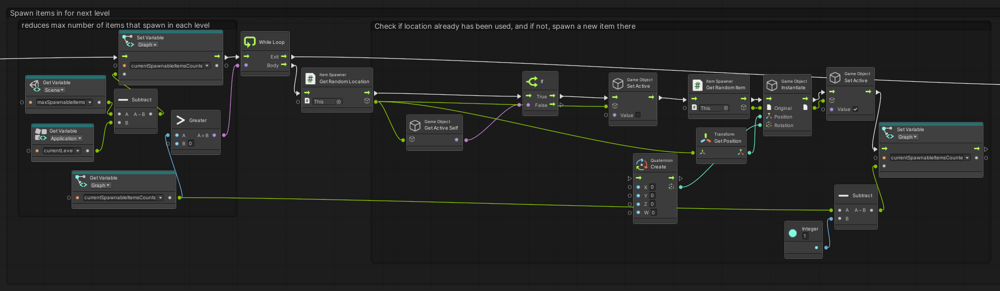
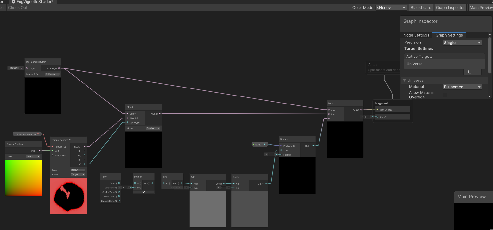
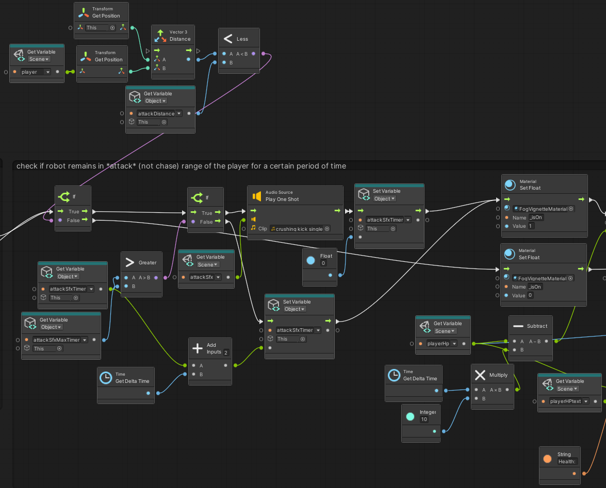

# GDIM33 Vertical Slice
## Milestone 1 Devlog
1.
I made the player movement a visual scripting graph. There are three main parts to this graph: movement, camera rotation, and extra controls.
Movement is detected with the OnInputSystemEvent Vector2 node; it translates the inputs from the keyboard into x and y coordinates. These coordinates are used to translate the player's x and z coordinates.
I intentionally excluded a jumping mechanic as that would introduce challenges that would make gameplay much harder to balance and control. In terms of the next part, camera rotation, I used the same node but with the 'look'
option. I also added mouse sensitivity, which is multiplied by the outputs from the node to rotate the camera along the x and y axes. Finally, the extra controls include sneaking and sprinting. Both are achieved by having a variable that changes
the current move speed. When the player presses and holds on a specific key (Z for sneaking and lshift for sprinting), the move speed is multiplied or divided by a set value. They also toggle respective booleans that affect the robot's detection range.

2.
Updated breakdown with state machine:
https://docs.google.com/drawings/d/1gc5vngVaGjAX02m7_Y1whSA0TJEfXJuqW6R97aFko5Y/edit
I added a state machine to the robot. This state machine has three states: Unloaded, Searching and Chasing. 

For the breakdown, I added the 3 states that the state machine can be in at any given time.

In the unloaded state, it is disabled. As for now, it exists as the robot's default state-this is intended to be the state it is in whenever a round is not actively occurring.

In the searching state, it first sets the speed of the robot (this matters when it is transitioning back from the chasing state), and then chooses a random place to move towards.
Afterwards, it checks whether it is within chasing distance of the player. This distance is dynamic; depending on whether the player is sneaking or not, it can increase or decrease.
This is tracked via a boolean that's updated by the player's script machine. If the robot is close enough, then it'll transition to the chase state. This is the robot's default state when it is 
enabled.

In the chase state, it increases its movement speed and locks onto the player's position. In this state, the robot has a secondary distance gauge; if it is touching the player, a counter begins.
When this counter reaches a certain threshold (5 seconds) it triggers a boolean which makes the player lose the game, and transitions the robot back to the unloaded state.
This counter is only reset when the robot leaves the chasing state-how the robot leaves is essentially the opposite of the way the robot enters the chase state. 

## Milestone 2 Devlog
# Complicating gameplay feature

Goal: The player takes constant damage in fog if they stay in it for too long.
1. Add health mechanic to player
	1. Add a scene variable for the player's HP.
	2. Add UI element that tracks the player's HP.

2. Create logic that will lower the player's HP depending on their position. Logic will be created in the GameController state machine, and should be present only in the Chase phase.
	1. Create gameObjects whose colliders will provide triggers for entering and exiting these fields.
	2. On contact, a timer will start. This timer tracks how many seconds the player is in the fog (the bounds of the gameObject). Once it reaches 0, their HP begins lowering.
	3. Once the player leaves the fog, the timer resets.

3. Make it actually work in-game.
	1. Use the item spawner C# script to randomly select fog locations, and enable the respective meshes.
	2. Create a semi-transparent material to differentiate the fog locations from non-fog covered locations.
	2. Reset the selection and enabling of these fog locations in LevelLoader.
	
# Post Coding Questions
1. Did the task steps break-down activity & quiz question (from W5) help you build a feature for this Milestone? 
Why or why not, and what would you do to improve your break-downs to be more helpful if you were to do them again?

Yes. Overall, the breakdown activity allowed me to easily visualize short, simple steps (most of the time) to build the fog feature.

2. Explain how you bridged visual scripting and code in your game. Are you calling a custom event from a Graph from a C# method, or vice versa, 
and what purpose does this serve in your architecture? Make sure to name the C# script(s) involved, and attach a screenshot of the relevant Graph.

While I didn't make the code for this feature specifically, I reused the same script for spawning items but for the fog instead. The script has methods to randomly choose an item from a list as well as randomly choose a spawn location from a different list.
C# script involved: 
ItemSpawner

Image - place where the script was called (found in the GameController state machine, in the LevelLoader state graph)

3. Briefly explain (in 1-2 sentences) what Unity system you want us to grade for Feature (3).

Inventory system. It can be found inside the PlayerInventory graph. It uses two lists - ItemManager and playerInventory, as well as a lot of other variables, to keep track, spawn, and delete instantiated items. The player can select an item, which is reflected in the UI, and then use or drop it. Essentially, it's a visualization of a list, as the UI slots update whenever an action is taken with the item.

## Milestone 3 Devlog

1.

I made a vignette that pulses when you are standing in foggy areas of the map. It can be found anywhere there is a translucent box (you may have to reload the level a few times as the locations it spawns in are randomly selected). It works by taking the rendered output of the scene in the URP Sample Buffer node and the vignette texture, and using the blend node to add the vignette texture onto it. Its pulsing is controlled by a lerp node, which uses a sin wave multiplied by time (which is also multiplied). I made its activation conditional by using a boolean in a branch node, which is called by the PlayerMovement script machine. 

2.
I improved the player controls, as some players thought that pressing C to sneak felt awkward. I also made it more evident that the player was in fog through the vignette.

3.
I added obstacles, textures, and models into my scene and moved the spawning locations of items to fit these obstacles. This way, the player can no longer just pick up items off the ground. They must scour the place first, find out where the items are, and then memorize their locations so that they can have better chances at escaping the robot.

## Final Devlog
1.

The core gameplay loop exists in a level. In each level, there are 2 phases: exploration, and survival (chase). The player is intended to look around and, well, explore during the exploration phase, where there is no active threat. Ideally, the player figures out safe spots to hide in, the location of items, or the layout of the room. The survival phase is where the player is supposed to hide, fight, or die to the robot, and should be much more intense. The full game would consist of similar levels, where the loop remains the same, but the items, enemies/monsters, map layout, and map effects all change. The average difficulty would steadily rise as the player gets higher and higher up the hotel.

2.
In about a paragraph, describe how your rendering effect is activated from gameplay logic. Either attach a screenshot of the relevant Graph OR cite the relevant C# file(s) so we can find them in your repo. Accurately describe your system with technical terms.

The rendering effect that is present in the game is a pulsing fullscreen damage effect, activated whenever the player takes damage (either from the robot or environmental fog). Below is a screenshot of the shadergraph. It is triggered specifically when the Branch node gets the state of isOn. isOn is changed by the robot's state machine, in the Chase graph. To get to the node that changes isOn (Material SetFloat), I have the robot check the distance from the player using the top section of the screenshot. If it's below attackDistance, then it sets isOn to 1. If not, it sets it to 0.

3.
Describe your process for how you break down a large project into specific systems. If you don't have a process that works well for you right now, you must come up with an describe a viable plan.
Make sure to also answer ALL of these questions in your answer:
Do you plan on using either the bubble diagram break-downs and/or the task step break-downs we practiced this quarter in your planning process? Why or why not?
How does the process of breaking down a large project into small steps affect your understanding of the scope of the project?
How does the plan you're describing relate to your process of creating the Vertical Slice project? You can write about either how things went poorly and how you'd improve your process as a result, or about how things went well that you want to repeat.

I first come up with the goal I want the game (or project) to be. For games, it'd be the player objective and experience. For other things like full animations, it'd be the intended story or technical level I want the project to achieve. 

Next, I attempt to figure out the systems that I need. For a game, I would figure out the core mechanics and rules of the game first. These are likely to remain changing until the player objective/experience is solidified. I usually start in my head, and as soon as I become confused on the logic of a system or mechanic (i.e. an inventory), I try to diagram or sketch it out. This would usually be done by one of three ways: either a flowchart, through steps, or a system map. The system maps primarily revolve around using a variant of the breakdowns done in class. Instead of bubbling everything in and mapping the relations between systems, it would be mainly used for one or two self-contained systems that only have a few external variables.
Once the systems and mechanics crucial to game's concept are mapped out, they reveal the true scope of the project.

For Hylan Hotel, I had trouble understanding the relations between the player, inventory, and trying to update the corresponding UI. I basically followed my plan, up until I got confused. I tried to brute force my way without making a visualization, and it only complicated things. Eventually, one of the TAs suggested I make a flowchart to visualize the logic and relations. This was the first time I had gotten confused, to a point where I couldn't just figure it out in my head within a reasonable timeframe. Making the flowchart did indeed allow me to figure out the logic (and thus make implementation much easier). From then on, I made a few other flowcharts, such as the robot states, or one specifically for the inventory system.

## Open-source assets
- Cite any external assets used here!

Unity's Toon Shader

### UI

Sky Antoniewicz - all UI assets, win/lose splash art

### Audio

[Horror Background Atmopshere](https://pixabay.com/sound-effects/horror-horror-background-atmosphere-156462/)

[Soft Rain Ambient](https://pixabay.com/sound-effects/soft-rain-ambient-111154/)

[Footsteps Leather Wood Walk](https://freesound.org/people/marb7e/sounds/620334/)

[Walking on Metal](https://freesound.org/people/Sanderboah/sounds/696374/)

[Crushing Kick x1](https://freesound.org/people/newlocknew/sounds/593909/)